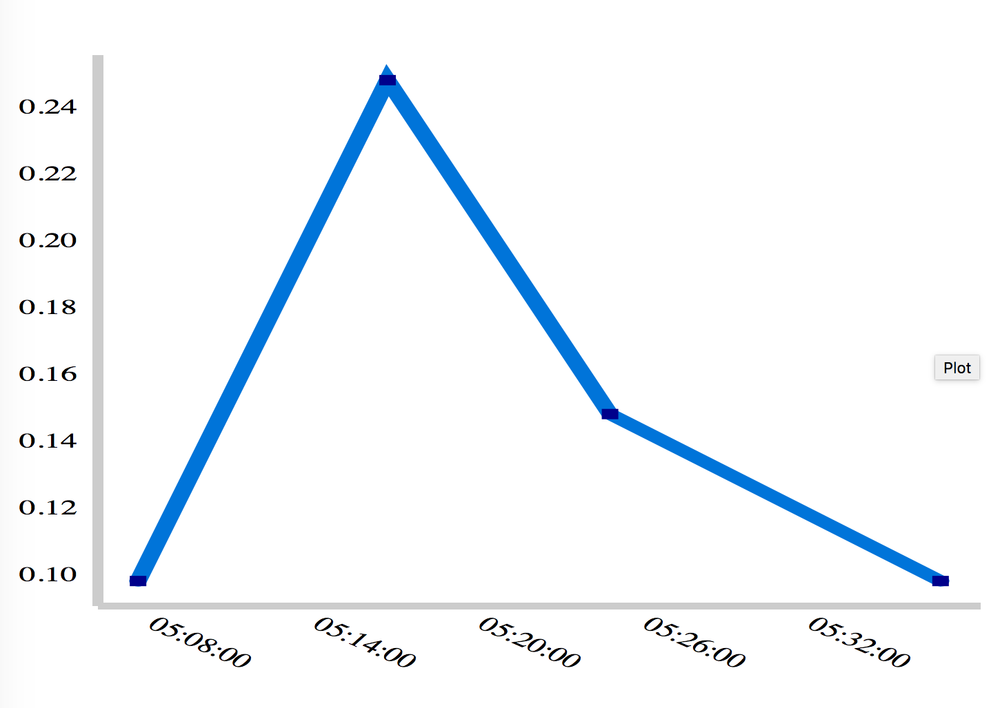

# Plotex

Pure Elixir library for producing simple plots. It's useful for producing streaming SVG graphs with the new Phoenix LiveView library. It could readily be used for other frameworks like Scenic. 

Warning, alpha status! It works, but is still very rough in many areas. However, it implements the fundamentals for plotting data. 

See units tests for examples of producing SVG graphs. 

## Changes

- v0.1.0 has basic plotting functionality included 
- v0.1.1 has support for NaiveDateTime (easier to convert to user local time on the fly)
- v0.1.1 added hex package 

## Next Features 

- The API and handline of the plot gutters need to be polished, including better support for changing aspect ratios 
- Add introspective abilities
- Add tests and verify multiple plots can be handled
- Make hex package 

### Features 

Supports creating axis and scaling for both numeric (floats) and DateTime series from Elixir Streams. All scaling and sizing can be modified, though the config API is still a work in progress. The graph generation is designed to be modular. There's a simple SVG output module in only about ~150 lines of code which is intended to be fully customizable with CSS. 

## Installation

```elixir
def deps do
  [
    {:plotex, "~> 0.1.0"}
  ]
end
```

## Example 

```elixir


def render(socket) do

    xdata = [
      DateTime.from_iso8601("2019-05-20T05:04:12.836Z") |> elem(1),
      DateTime.from_iso8601("2019-05-20T05:13:17.836Z") |> elem(1),
      DateTime.from_iso8601("2019-05-20T05:21:23.836Z") |> elem(1),
      DateTime.from_iso8601("2019-05-20T05:33:25.836Z") |> elem(1),
    ]
    ydata = [0.1, 0.25, 0.15, 0.1]

    plt = Plotex.plot(
      [{xdata, ydata}],
      xaxis: [kind: :datetime,
              ticks: 5,
              padding: 0.05]
    )
    Logger.warn("svg plotex cfg: #{inspect plt, pretty: true }")

    svg_str =
      Plotex.Output.Svg.generate(
        plt,
        xaxis: [rotate: 35, dy: '2.5em' ],
        yaxis: [],
      ) |> Phoenix.HTML.safe_to_string()

    Logger.warn("SVG: \n#{svg_str}")
    assigns = [svg_str: svg_str]

    ~L"""
    <html>
    <head>
      <style>
        .graph .labels .x-labels {
          text-anchor: middle;
        }
        .graph .labels, .graph .y-labels {
          text-anchor: middle;
        }
        .graph {
          height: 500px;
          width: 800px;
        }
        .graph .grid {
          stroke: #ccc;
          stroke-dasharray: 0;
          stroke-width: 1.0;
        }
        .labels {
          font-size: 3px;
        }
        .labels .x-labels {
          font-size: 1px;
        }
        .label-title {
          font-size: 8px;
          font-weight: bold;
          text-transform: uppercase;
          fill: black;
        }
        .data .data-point {
          fill: darkblue;
          stroke-width: 1.0;
        }
        .data .data-line {
          stroke: #0074d9;
          stroke-width: 0.1em;
          stroke-width: 0.1em;
          stroke-linecap: round;
          fill: none;
        }
      </style>
    </head>
    <body>
      <%= @svg_str %>
    </body>
    </html>
    """
end

```

[Example DateTime Output](./test/output-dt-hours.html)



Note, SVG uses a "graphics" coordinate system where the X-Y origin are centered on the top-left. Most graphing configurations assume the X-Y origin is in the bottom left. The SVG output adjusts this by setting the Y origin to range from `-100..0` and adds a negative sign to the Y-data axis. This turns out to be the simplest general way to adjust the SVG origin. 


## TODO

- [ ] The configuration API needs to be expanded upon. 
- [ ] Needs work in simplifying adjusting the axis gutter widths and adjusting the ratio (this works but is very manual). 
- [ ] Documentation!  
- [ ] Would like to remove the dependency on Calendar and TZData dependency.  
- [ ] PR's welcome. 

