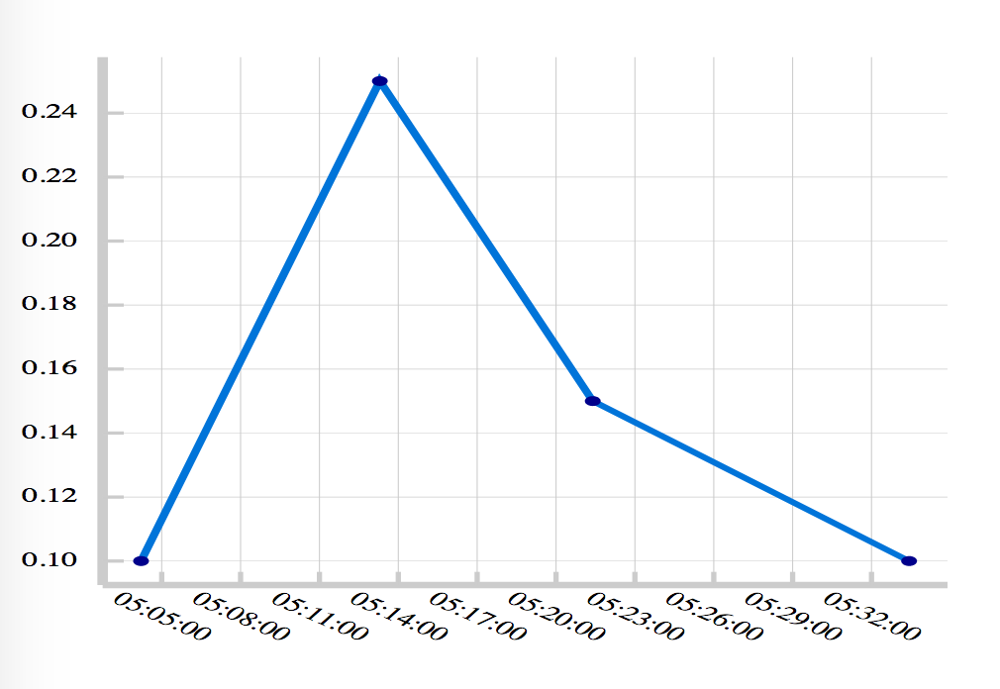
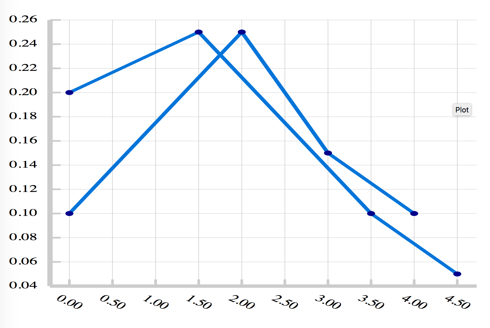

# Plotex

Pure Elixir library for producing simple plots time-series plots. Currently it only supports SVG which can be used Phoenix static or LiveView pages. 

See units tests for more examples of producing SVG graphs. The SVG can be styled using CSS. 

## Changes

- v0.3.0 switch SVG generation to use markers -- should significantly reduce bandwith and svg elements
- v0.2.2 fixed multi-graph support, added test `output-dual.html`
- v0.2.1 added optional support for :cldr_datetime in addition to :calendar for datetime
- v0.2.0 refactored some of the options 
- v0.1.1 added hex package 
- v0.1.1 has support for NaiveDateTime (easier to convert to user local time on the fly)
- v0.1.0 has basic plotting functionality included 

# Features 

Supports creating axis and scaling for both numeric and DateTime/NaiveDateTime series from Elixir Streams or Enums. Scaling and sizing can be modified with CSS used for styling everything else including font sizes. 

Graph generation is designed to be modular. 

## Future Features 

- The API and handline of the plot gutters need to be polished
- Better better support for changing aspect ratios 
- Legends
- Add introspective abilities


## Installation

```elixir
def deps do
  [
    {:plotex, "~> 0.1.0"}
  ]
end
```

## Example 

```elixir

defmodule ExampleSVG.Graph

  alias Plotex.Output.Options

  @doc " Create Plotex Graph "
  def plot() do
      xdata = [
        ~U[2019-05-20T05:04:12.836Z],
        ~U[2019-05-20T05:13:17.836Z],
        ~U[2019-05-20T05:21:23.836Z],
        ~U[2019-05-20T05:33:25.836Z]
      ]
      ydata = [0.1, 0.25, 0.15, 0.1]
      graph_data = {xdata, ydata}

      plt = Plotex.plot(
        [ graph_data ],
        xaxis: [kind: :datetime, ticks: 5, padding: 0.05] 
      )
      
      Logger.warn("svg plotex cfg: #{inspect plt, pretty: true}")
      
      plt
  end

  def render(socket) do
      plt = plot()
      
      # These options aren't really documented, but 
      # the plotex_test.ex contains most of the basic
      # usages. 
      svg_str =
        plt |>
        Plotex.Output.Svg.generate(
          %Options{
            xaxis: %Options.Axis{
            label: %Options.Item{rotate: 35, dy: '2.5em'}},
          width: 140,
          height: 105
        })
        |> Phoenix.HTML.safe_to_string()

      assigns = [svg_str: svg_str]

      ~L"""
      <html>
        <head>
          <style>
            #{Plotex.Output.Svg.default_css()}
          </style>
        </head>
        <body>
          <%= @svg_str %>
        </body>
      </html>
      """
  end
end
```

[Example DateTime Output](./test/output-dt-hours.html)




Note, SVG uses a "graphics" coordinate system where the X-Y origin are centered on the top-left. Most graphing configurations assume the X-Y origin is in the bottom left. The SVG output adjusts this by setting the Y origin to range from `-100..0` and adds a negative sign to the Y-data axis. This turns out to be the simplest general way to adjust the SVG origin. 


## TODO

- [ ] The configuration API needs to be expanded upon. 
- [ ] Needs work in simplifying adjusting the axis gutter widths and adjusting the ratio (this works but is very manual). 
- [ ] Documentation!  
- [ ] Would like to remove the dependency on Calendar and TZData dependency.  
- [ ] PR's welcome. 

